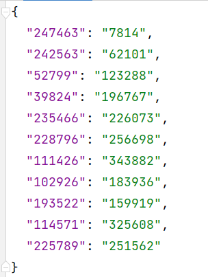
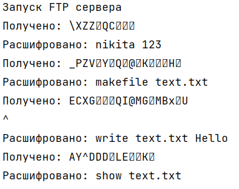

## Алгоритмы асимметричного шифрования

### Цель работы

Познакомиться с принципами работы протоколов рукопожатия в современных компьютерных системах

### Дополнительные задания

1. Модифицируйте код клиента и сервера так, чтобы приватный и публичный ключ хранились в текстовых файлах на диске и, таким образом, переиспользовались между запусками. 

Ключи клиента

Публичный ключ клиента

Приватный ключ клиента

Ключи сервера

Публичный ключ клиента

Публичные и приватные ключи клиентов, которые хранятся в виде пар ключ-значение, где ключ - публичный ключ, а значение - приватный. По этому файлу осуществляется сертификация публичного ключа клиента.

Ключи генерируются модулем keygen.py. Он создает для теста 10 рандомных ключей на стороне сервера и 1 сертифицированный ключ для клиента. Ключи вычисляются по алгоритму, описанному в основной методичке.

Вот так работает шифрование. Уже сразу оно реализовано на FTP-сервере.

2. Проведите рефакторинг кода клиента и сервера так, чтобы все, относящееся к генерации ключей, установлению режима шифрования, шифрованию исходящих и дешифрованию входящих сообщений было отделено от основного алгоритма обмена сообщениями.\

Для этого были реализованы два пакета. Первый содержит логику FTP-сервера и клиента, а второй - реализацию защищенного сервера.

4. Реализуйте на сервере проверку входящих сертификатов. На сервере должен храниться список разрешенных ключей. Когда клиент посылает на сервер свой публичный ключ, сервер ищет его среди разрешенных и, если такого не находит, разрывает соединение. Проверьте правильность работы не нескольких разных клиентах.

Список сертифицированных публичных ключей клиентов:

Если публичный ключ сертифицировнный (он остался таким, каким его сгенерировал keygen.py), для клиента разворачивает FTP-сервер.

Попробуем удалить одну цифру из публичного ключа клиента.

Сервер нас не сертифицировал и отклонил подключение.

У клиента выводится об этом сообщение.

4. Модифицируйте код клиента и сервера таким образом, чтобы установление режима шифрования происходило при подключении на один порт, а основное общение - на другом порту. Номер порта можно передавать как первое зашифрованное сообщение. 

Сервер:

Клиент:

5. Реализуйте пул портов.

Из пула портов выбирается рандомный свободный порт и отправлятся клиенту.

6. Модифицируйте код FTP-сервера таким образом, чтобы он поддерживал шифрование.

Клиент (ответ сервера содержит код ответа - один символ, шифруется, и pwd пользователя):

Сервер:

